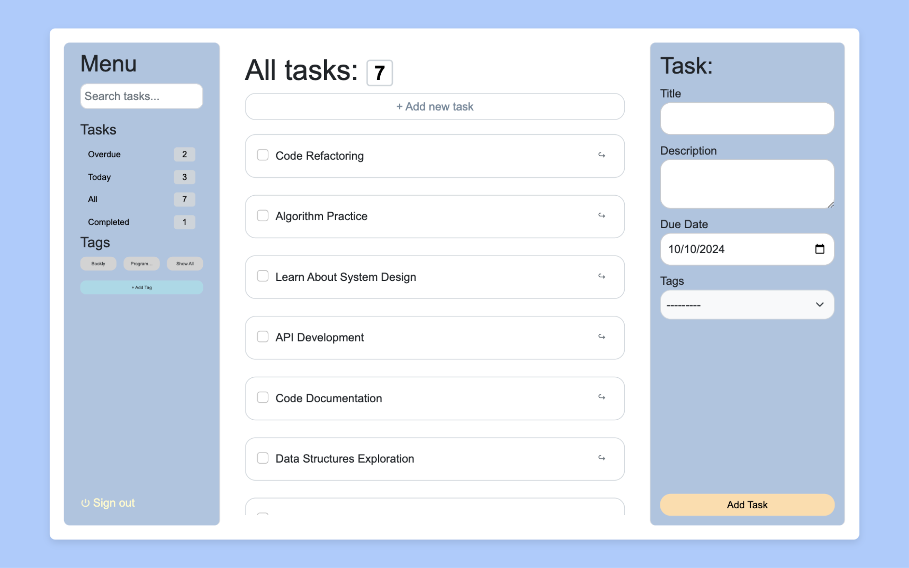
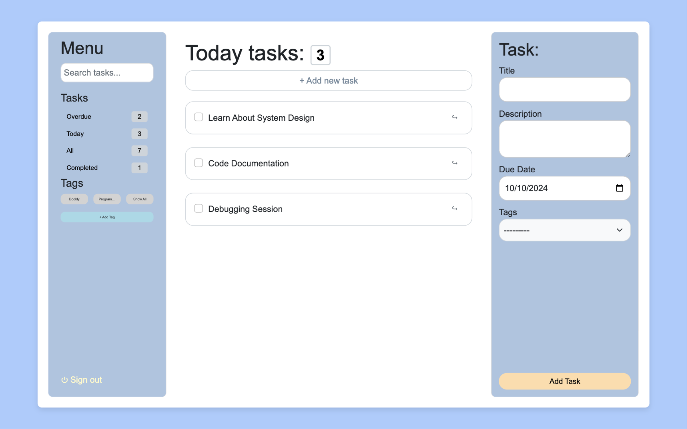
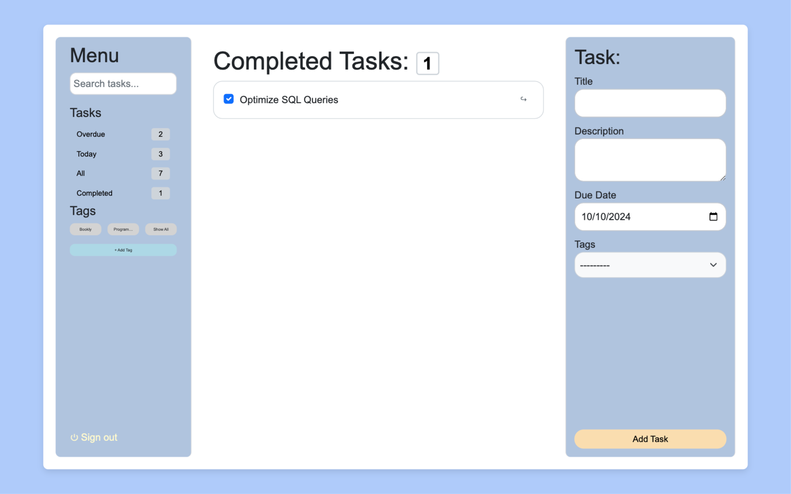
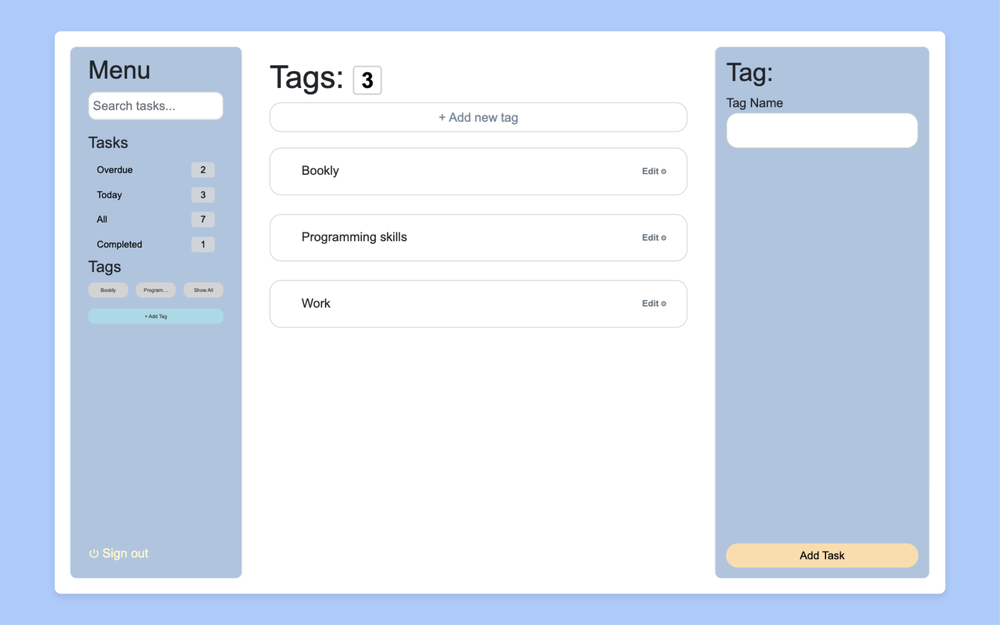
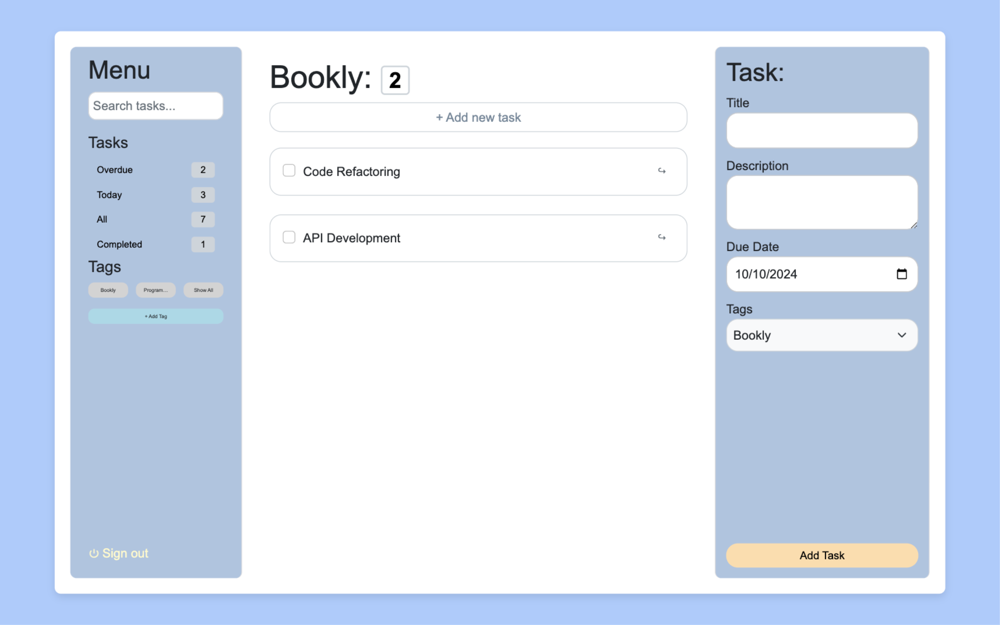
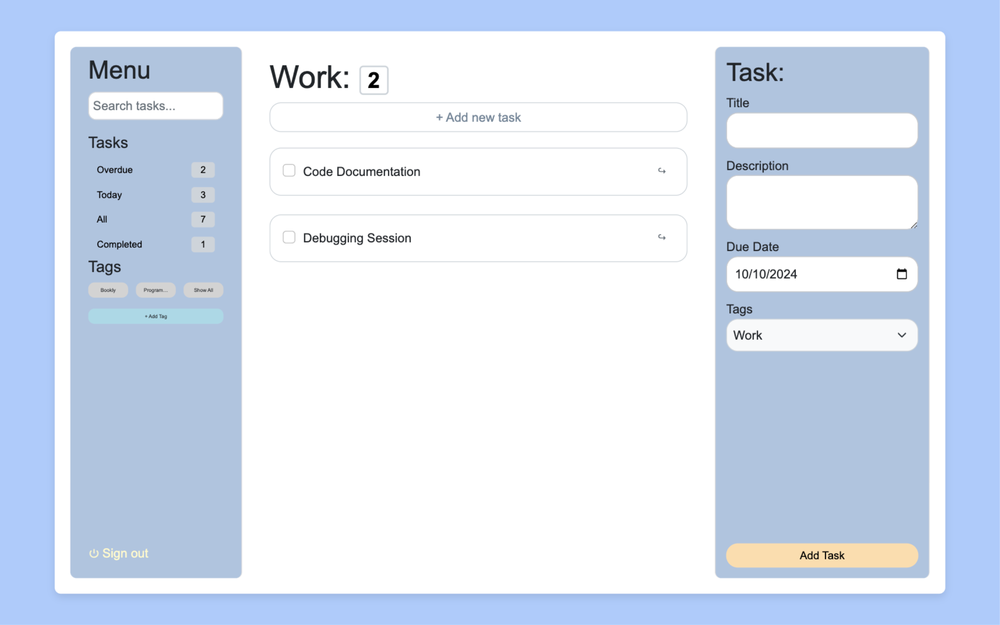

# ToDo Application


This is a comprehensive web application designed to streamline task management. Users can effortlessly create, read, 
update, and delete tasks, ensuring efficient organization and productivity. 
The application leverages the robust Django framework, known for its scalability and security, 
and is seamlessly hosted on Heroku, providing reliable and scalable cloud hosting.  

#### Key features include:  
- **Task Creation:** Users can add new tasks with detailed descriptions, due dates, and tags for better categorization.
- **Task Viewing:** Tasks are displayed in various categories such as All, Overdue, Today, and Completed, allowing users to easily track their progress.
- **Task Editing:** Users can update task details, ensuring that information remains current and accurate.
- **Task Deletion:** Unnecessary tasks can be removed, helping users maintain a clutter-free task list.
- **Tagging System:** Tasks can be tagged, enabling users to filter and organize tasks based on specific criteria. 

_The application is designed with a user-friendly interface, making task management intuitive and efficient._

**Live demo: [ToDo Application](https://todo-appliccation-31ed3db3f0b5.herokuapp.com/tasks)**

## Table of Contents

- **[Technologies](#technologies)**
- **[Getting Started](#getting-started)**
- **[Usage](#usage)**
- **[Contributing](#contributing)**
- **[License](#license)**
- **[Contact](#contact)**
- **[Screenshots](#screenshots)**

## Technologies

- **[Django](https://www.djangoproject.com/):**  A high-level Python web framework that encourages rapid development and clean, pragmatic design.
- **[PostgreSQL](https://www.postgresql.org/):**  An open-source relational database system known for its robustness and reliability.
- **[Bootstrap](https://getbootstrap.com/):**  A popular CSS framework for building responsive and mobile-first websites.

## Getting Started

1. Clone the repository:
    ```sh
    git clone https://github.com/99bruno/ToDo_WebApplication .git
    cd ToDo_WebApplication 
    ```

2. Create a virtual environment and activate it:
    ```sh
    python3 -m venv venv
    source venv/bin/activate
    ```

3. Install the required packages:
    ```sh
    pip install -r requirements.txt
    ```
   
4. Install PostgreSQL and create a database:

   - **macOS:**
    ```sh
    sudo apt-get install postgresql
   ```
    ```sh
    sudo -u postgres psql
   ```
   ```sh sql
    CREATE DATABASE todolist;
    CREATE USER todolistuser WITH PASSWORD 'password';
    ALTER ROLE todolistuser SET client_encoding TO 'utf8';
    ALTER ROLE todolistuser SET default_transaction_isolation TO 'read committed';
    ALTER ROLE todolistuser SET timezone TO 'UTC';
    GRANT ALL PRIVILEGES ON DATABASE todolist TO todolistuser;
    \q
    ```
   
    - **Windows:**
     
      1. Download and install PostgreSQL from https://www.postgresql.org/download/
      2. Open pgAdmin and create a new database named todolist
      3. Create a new user named todolistuser with password 'password'
      4. Grant all privileges to the user todolistuser for the database todolist


5. Add the database configuration to the settings.py file:
    ```sh python
    DATABASES = {
        'default': {
            'ENGINE': 'django.db.backends.postgresql',
            'NAME': 'todolist',
            'USER': 'todolistuser',
            'PASSWORD': 'password',
            'HOST': 'localhost',
            'PORT': '5432',
        }
    }
    ```

6. Make migrations:
    ```sh
    python manage.py makemigrations
    ```
   
7. Apply migrations:
    ```sh
    python manage.py migrate
    ```
8. Run the development server:
    ```sh
    python manage.py runserver
    ```

## Usage

- Navigate to **[http://127.0.0.1:8000/](http://127.0.0.1:8000/)** in your web browser.
- Register a new user or log in with existing credentials.
- Start managing your tasks!

## Contributing

Contributions are welcome! Please fork the repository and create a pull request with your changes.

## License

This project is licensed under the MIT License. See the **[LICENSE](LICENSE)** file for more details.

## Contact

For any inquiries or feedback, please contact **[99bruno](https://github.com/99bruno)**.

---
## Screenshots

<p align="center">
  
  
  
</p>
<p align="center" style="font-size: 1em; font-style: italic;">
Tasks Application Screenshots
</p>

<p align="center">
  
  
  
</p>
<p align="center" style="font-size: 1em; font-style: italic;">
Tags Application Screenshots
</p>

